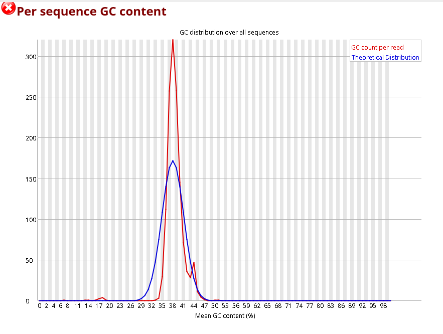
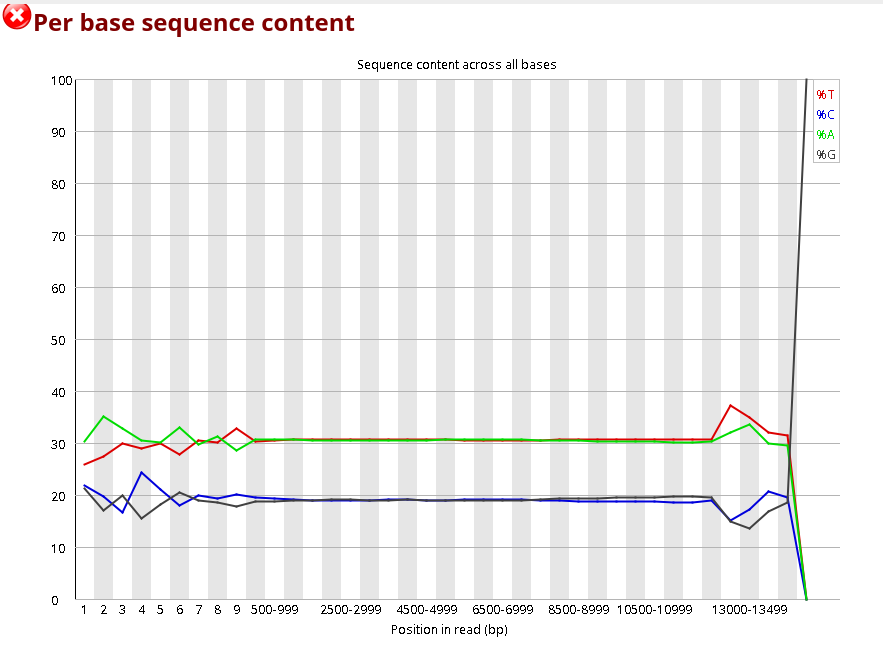

# LongReadDeNovoAssembly_BINP29

# install
## file tree
```bash
mkdir Data/ Data/Raw_reads Results/ Results/01_fastqc/
```
## git
```bash
git clone https://github.com/resabut/LongReadDeNovoAssembly_BINP29.git
```
 


.gitignore

    /Data
    /Results
## Download data
[Reads](https://trace.ncbi.nlm.nih.gov/Traces/?view=run_browser&acc=SRR13577846&display=download) 
Download the fastqc and unzip it
```bash
gunzip Data/Raw_reads/SRR13577846.fastq.gz
```

It is a dataset containing HiFi Pacbio reads from the yeast *Saccharomyces cerevisiae*


to make read-only the data directory
```bash
chmod a=r Data/
```

# conda env
```bash
conda create -n longread
conda activate longread
conda install fastqc=0.11.* quast=5.2.* busco=5.4.* multiqc=1.14 canu=
```

I will use canu for the assembly


# MAIN PART
## fastqc
```bash
fastqc Data/Raw_reads -o Results/01_fastqc/
```
The quality of the reads is very good, but we run into some problems. 
The GC content doesn't fit the expected distribution. Also, when we look at the gc content per base, it is unequal at both ends.


