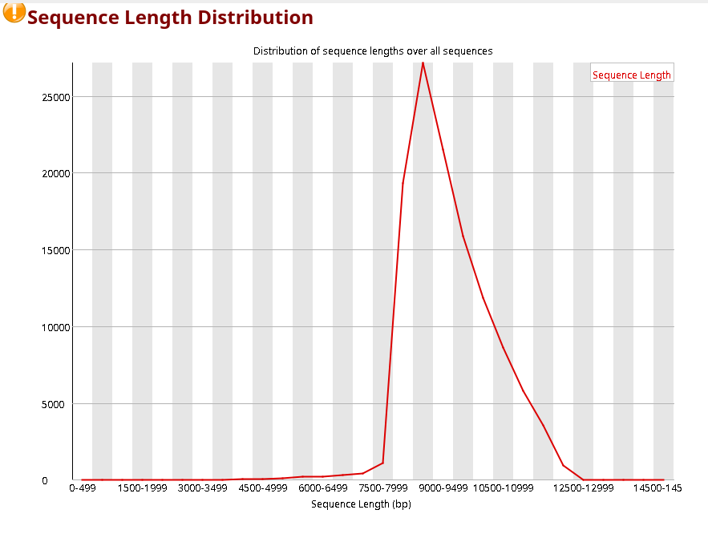
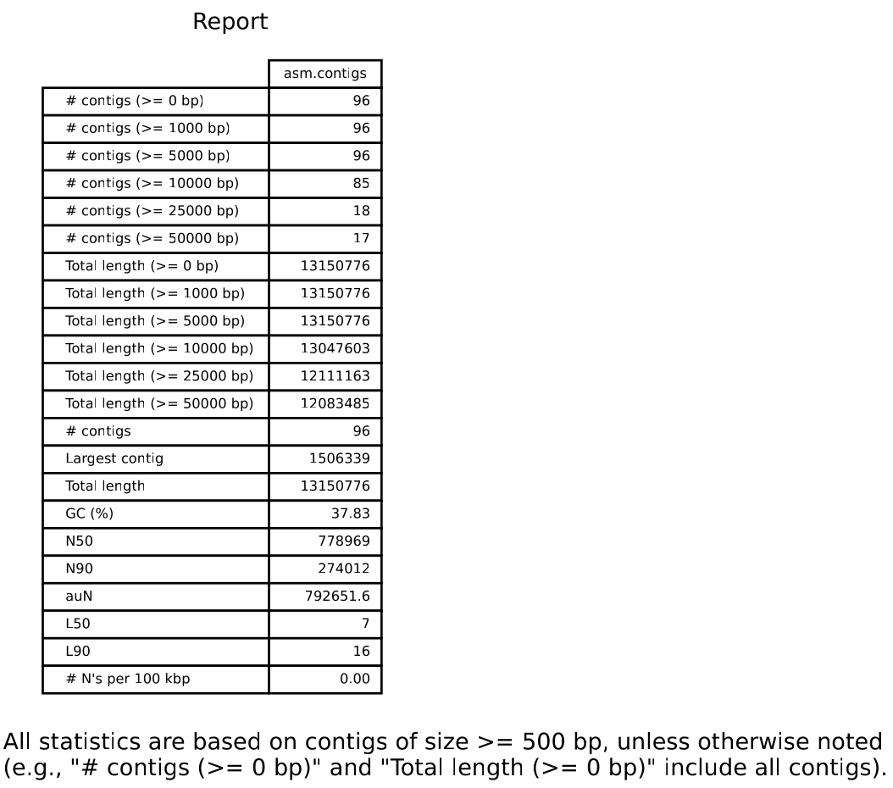

# LongReadDeNovoAssembly_BINP29

## Version control(git)

```bash
git clone https://github.com/resabut/LongReadDeNovoAssembly_BINP29.git
```
.gitignore

    /Data
    /Results
    busco_2646102.log
    busco_downloads/

# Installation and set-up

## Download data
[Reads](https://trace.ncbi.nlm.nih.gov/Traces/?view=run_browser&acc=SRR13577846&display=download) 
Download the fastqc and unzip it
```bash
gunzip Data/Raw_reads/SRR13577846.fastqc.gz
```
It is a dataset containing HiFi Pacbio reads from the yeast *Saccharomyces cerevisiae*, strain CEN.PK.


The [reference sequence](https://www.ncbi.nlm.nih.gov/genome/15?genome_assembly_id=22535) is taken for the strain S288C.
Down the reference genome and the annotation.
```bash
gunzip Data/Reference/GCF_000146045.2_R64_genomic.gff.gz
```

to make read-only the data directory
```bash
chmod a=r Data/
```

# conda env
# conda env general
```bash
conda create -n longread
conda activate longread
conda install fastqc=0.11.* quast=5.2.* multiqc=1.14 canu=2.2
```

## conda env for busco
```bash
conda create -n longread_busco busco=5.4.5
```
A new environment has to be created
I will use canu for the assembly


# MAIN PART
## 1. FASTQC
```bash
fastqc Data/Raw_reads -o Results/01_fastqc/
```
The quality of the reads is very good, but we run into some problems. 
The GC content doesn't fit the expected distribution. 

Also, when we look at the gc content per base, it is unequal at both ends.


Some of these could be due to the heterogeneous length of the reads. 
There are very few long reads, which determines the composition of the ends of the reads in the previous part of the read.




## 2. CANU

[Canu](https://canu.readthedocs.io/en/latest/quick-start.html) has a 3-step approach to long-read genome assembly.
* Correction: improves the accuracy of the bases.
* Trimming: eliminates low-quality parts of the sequences.
* Assembly: constructs the contigs, generates the consensus sequences and creates graphs of alternate paths.

### First run
```bash
canu \
 -p asm -d Results/02_yeast \
 genomeSize=12.1m \
 -raw \
 maxThreads=10 \
 -pacbio-hifi Data/Raw_reads/SRR13577846.fastq
```
From the Results/02_yeast/asm.report file
```bash
cat Results/02_yeast/asm.report | less
```
    --   Found 117521 reads.
    --   Found 1103859512 bases (91.22 times coverage).
From here we see that the coverage was over 90x

From the Results/02_yeast/asm.report file

    [UNITIGGING/CONTIGS]
    -- Found, in version 1, after unitig construction:
    --   contigs:      58 sequences, total length 8910468 bp (including 54 repeats of total length 465278 bp).
    --   bubbles:      38 sequences, total length 377304 bp.
    --   unassembled:  7681 sequences, total length 51147127 bp.
    --
    -- Contig sizes based on genome size 12.1mbp:
    --
    --            NG (bp)  LG (contigs)    sum (bp)
    --         ----------  ------------  ----------
    --     10      796598             2     1860130
    --     20      769110             3     2629240
    --     30      646077             5     3947801
    --     40      552670             7     5071711
    --     50      481798             9     6082428
    --     60      399788            12     7324771
    --     70      158927            17     8548060
    --

    [UNITIGGING/CONSENSUS]
    -- Found, in version 2, after consensus generation:
    --   contigs:      58 sequences, total length 12618858 bp (including 54 repeats of total length 679715 bp).
    --   bubbles:      38 sequences, total length 531918 bp.
    --   unassembled:  7681 sequences, total length 72735645 bp.
    --
    -- Contig sizes based on genome size 12.1mbp:
    --
    --            NG (bp)  LG (contigs)    sum (bp)
    --         ----------  ------------  ----------
    --     10     1506339             1     1506339
    --     20     1126163             2     2632502
    --     30     1088934             3     3721436
    --     40      914946             5     5588753
    --     50      808829             6     6397582
    --     60      745377             8     7921928
    --     70      681590             9     8603518
    --     80      579998            11     9793730
    --     90      437058            14    11235933
    --    100       27678            18    12111163
    --

The difference between the contig and consensus sequences, according to ChatGPT is:
In the context of PacBio genome assembly, Canu generates two types of output: contigs and consensus sequences. Here's the difference between them:

    Contigs: A contig is a contiguous stretch of DNA sequence that is assembled from the reads. Canu generates contigs 
    by assembling the long PacBio reads into overlapping pieces and then merging them into longer sequences. Contigs are
    represented as individual sequences, each representing a unique genomic region.

    Consensus sequences: A consensus sequence is a single, high-quality DNA sequence that represents the most probable 
    sequence of a genomic region. Canu generates consensus sequences by polishing the contigs. This process involves 
    refining the consensus sequence by correcting any errors in the assembly, filling in gaps, and resolving ambiguities.
    The final consensus sequence represents a more accurate representation of the underlying genomic region.

    In summary, the primary difference between Canu contigs and consensus sequences is that contigs are individual 
    genomic regions that have been assembled from the reads, while consensus sequences are high-quality, error-corrected
    versions of those same regions. While both contigs and consensus sequences can be useful for downstream analyses, 
    consensus sequences are generally considered to be more accurate and reliable than contigs.

## 3. QUAST
```bash
mkdir Results/03_Quast
quast Results/02_yeast/asm.contigs.fasta -o Results/03_Quast
```


Run Quast with reference genome and annotation
```bash
quast Results/02_yeast/asm.contigs.fasta \
  -r Data/Reference/GCF_000146045.2_R64_genomic.fna.gz \  # reference genome
  -g Data/Reference/GCF_000146045.2_R64_genomic.gff \  # reference annotation
  -o Results/03_Quast/Reference
```
Here is the report:
All statistics are based on contigs of size >= 500 bp, unless otherwise noted (e.g., "# contigs (>= 0 bp)" and "Total length (>= 0 bp)" include all contigs).

    Assembly                     asm.contigs     
    # contigs (>= 0 bp)          96              
    # contigs (>= 1000 bp)       96              
    # contigs (>= 5000 bp)       96              
    # contigs (>= 10000 bp)      85              
    # contigs (>= 25000 bp)      18              
    # contigs (>= 50000 bp)      17              
    Total length (>= 0 bp)       13150776        
    Total length (>= 1000 bp)    13150776        
    Total length (>= 5000 bp)    13150776        
    Total length (>= 10000 bp)   13047603        
    Total length (>= 25000 bp)   12111163        
    Total length (>= 50000 bp)   12083485        
    # contigs                    96              
    Largest contig               1506339         
    Total length                 13150776        
    Reference length             12157105        
    GC (%)                       37.83           
    Reference GC (%)             38.15           
    N50                          778969          
    NG50                         808829          
    N90                          274012          
    NG90                         437058          
    auN                          792651.6        
    auNG                         857439.7        
    L50                          7               
    LG50                         6               
    L90                          16              
    LG90                         14              
    # misassemblies              108             
    # misassembled contigs       37              
    Misassembled contigs length  12398790        
    # local misassemblies        319             
    # scaffold gap ext. mis.     0               
    # scaffold gap loc. mis.     0               
    # unaligned mis. contigs     0               
    # unaligned contigs          6 + 21 part   

We can extract the N50, NG50, total length, the number of missassemblies.

## 4. BUSCO
```bash
conda activate longread_busco # NOTE: busco required packages conflict with the rest
mkdir Results/04_Busco
busco -i Results/02_yeast/asm.contigs.fasta \
  -o canu \
  --out_path Results/04_Busco \
  -l saccharomycetes_odb10 \  # appropriate dataset for Saccharomyces
  -m genome
```

Here is an extract of the BUSCO report

    ***** Results: *****
    
        C:99.7%[S:96.2%,D:3.5%],F:0.1%,M:0.2%,n:2137	   
        2129	Complete BUSCOs (C)			   
        2055	Complete and single-copy BUSCOs (S)	   
        74	Complete and duplicated BUSCOs (D)	   
        2	Fragmented BUSCOs (F)			   
        6	Missing BUSCOs (M)			   
        2137	Total BUSCO groups searched